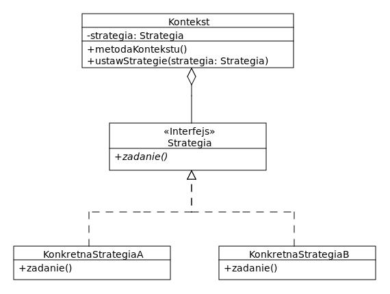

# Strategia / Komenda

**Strategia** – czynnościowy wzorzec projektowy, który definiuje rodzinę wymiennych algorytmów i owija każdy w klasę. Umożliwia wymienne stosowanie każdego z nich spinając je w hierarchię (interfejsem lub klasą abstrakcyjną) w trakcie działania aplikacji niezależnie od korzystających z nich użytkowników.

## Budowa
We wzorcu Strategia definiujemy wspólny interfejs dla wszystkich obsługiwanych algorytmów i zawierający wszystkie dozwolone operacje. Następnie implementujemy go w poszczególnych klasach dostarczających konkretne algorytmy. Dodatkowo, we wzorcu wyróżniamy także klienta korzystającego z algorytmów. Posiada on referencję do aktualnie używanej strategii oraz metodę ustawStrategie(), która pozwala ją zmienić.

## Zadanie
Dana jest klasa Wojownik z metodą wojuj(). W zależności od dostarczonej broni, wojownik inaczej wojuje. Przerób kod stosując wzorzec projektowy strategia i dodaj dwa nowe rodzaje broni dla wojownika. 

